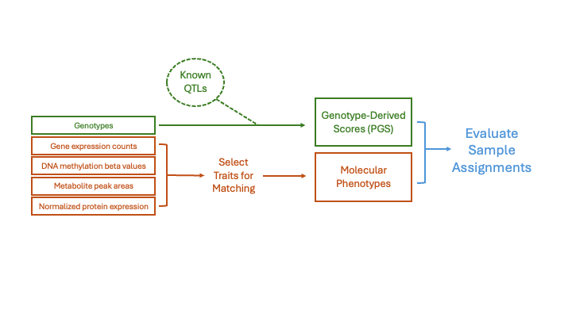

# PGS-Based Sample Identity Checking TOPMed Multi-Omics Data
Multi-omics data generated through the TOPMed program is evaluated for sample identity at the TOPMed Informatics Research Center (IRC).  The IRC leverages summary statistics from published cis- and trans- molecular quantitative trait locus (xQTL) studies to compute polygenic scores (PGS) for thousands of molecular traits.  Although individual PGS explain only small fractions of trait variance, their aggregated signal provides useful QC metrics when combined across multiple individuals. While this pipeline was developed for application to TOPmed data, this stratagy is assay- and technology-independent and can thus be deployed on arbitrary multi-omics studies with matched genotypes


## Pipeline workflow



## How to run
```
nextflow run main.nf -c config.runx --type [data type] --settings [local parameters]
```

## Arguments
*type*      : data type that can take one of four values -- rnaseq, methylation, metabolomics, or proteomics
*settings*  : a CSV file withch provides analysis-specific parameters. The first column specifying the desired prefix for output files.  The second column should contain the full path location to the molecular phenotype files.  For RNAseq, metabolomics, and proteomics, this must specify the location of the gene expression summary table, metabolite peak area table, and the proteomics NPX table respectively.  For methylation, this should be the LEVEL3 directory which contains the noob-adjusted beta values. Finally for metabolomics and proteomics, the settings file must contain a third column: for metabolomics this is the full path location to the chemical annotation file, whereas for proteomics this is a column mapping file which specifies which columns in the NPX data file correspond to the NPX, Sample ID, and Assay ID.  Prior to any run, a preliminary step must be taken to calculate PGS based on known QTLs (see below).  

## Results

-------------------------
## Pileup-Based Sample Identity Checking
***RNAseq*** \
In brief, the RNA sample identity checking follows the following procedure
1. Input data we need include (a) VCF file containing WGS-based genotypes, and (b) BAM files from RNA-seq reads
2. Genotype VCF file is converted into PGEN format using `plink2`, subsetted to relevant samples and variants within exons. 
3. Using the `bcdseq plp-dump` tool, create pileups from RNA-seq reads on the specified variant sites. Typical output file size could be ~5MB.
4. Using the `qpgentools match-plp-geno` tool, identify the best-matching sample IDs from the VCF with the pileups from RNA-seq

## Methylation Finger-print SNP Identity Checking (Metylation)
***Methylation*** \
