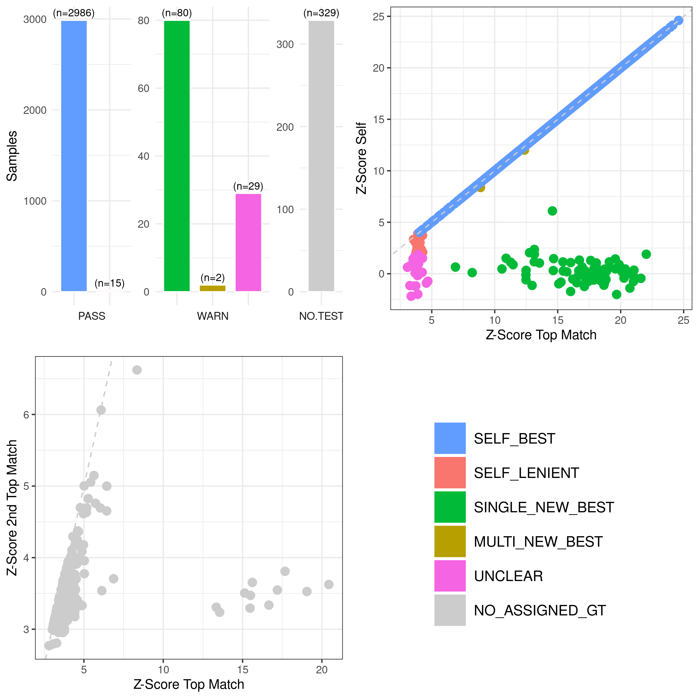

# PRS-Based Sample Identity Matching for Multi-Omics Data

This Nextflow pipeline automates an identity-check method that leverages summary
statistics from published cis- and trans-molecular quantitative trait locus
(xQTL) studies to compute polygenic scores (PGS) for thousands of molecular
traits. These PGS are then compared against measured trait values from
multi-omics data to evaluate whether omics samples are correctly assigned to
their corresponding genotype data.

The method was originally developed and validated using data from the
[TOPMed](https://topmed.nhlbi.nih.gov/) program, but it is generalizable to
any study with paired genotype and multi-omics data.

## Table of Contents
- [Requirements](#requirements)
- [Quick Start](#quick-start)
- [Pipeline Workflow](#pipeline-workflow)
- [Configuration](#configuration)
- [Creating a Settings File](#creating-a-settings-file)
- [Calculating PGS Using `pair-prs`](#calculating-pgs-using-pair-prs)
- [Running the Pipeline](#running-the-pipeline)
- [Understanding the Results](#understanding-the-results)
- [Example Input Files](#example-input-files)
- [Support](#support)

---


## Requirements

| Dependency | Notes |
|---|---|
| [Nextflow] | Tested with version `>=26.04.4` |
| Java | Required by Nextflow; version `>=11` recommended |
| R | Version `>=4.6` — with the following packages installed: `data.table`, `ggplot2`, `gridExtra` |
| [`qpgentools`](https://github.com/hyunminkang/qpgen) | Required for PGS calculation (`pair-prs`) and identity matching (`match-prs-pheno`). |

> **Note:** This pipeline calls `qpgentools` as an external binary. 
> Ensure it is installed and added to your `PATH`. Follow installation 
> [instructions](https://github.com/hyunminkang/qpgen). To ensure 
> `qpgentools` is compatible with your input files, index your PLINK2 
> variant file (see section *Preparing input files* in the `qpgen` 
> documentation)

---

## Quick Start

A minimal test dataset is provided in `example/` to verify your installation works end-to-end. This example contains RNAseq and PGS from 50 samples from the 1000 Genomes Project. These are a subset of the participants used in the Multi-ancestry Analysis of Gene Expression ([MAGE][https://github.com/mccoy-lab/MAGE/]) data set.

```bash
git clone https://github.com/jblam251/tm-match-pheno-prs.git
cd tm-match-pheno-prs
nextflow run main.p3.nf -c etc/nf.config.runx --settings example/settings.csv
```
The example should complete without errors and produce the following files:
```
rnaseq.run1.results.weights.tsv.gz
rnaseq.run1.results.match.assigned.tsv.gz
rnaseq.run1.results.match.all.tsv.gz
rnaseq.run1.diagnostic.plot.png
```


## Pipeline Workflow


1. Converts omics-specific molecular phenotype files into a PLINK-compatible format with sample identifiers in the first two columns (FID, IID) followed by the molecular traits in the remaining columns. This step is skipped if phenotypes are already in PLINK-compatible format.
2. Generates a genotype-to-omics identifier map.
3. Subsets the polygenic score file to the relevant traits and samples.
4. Compares polygenic scores to observed molecular phenotypes to assess sample identity.
5. Generates a set of diagnostic plots.


## Creating a Settings File
A settings file is required to import the molecular phenotypes, polygenic scores, and identifier mapping tables amongst other resources. This is a comma-separated (CSV) file containing one row per dataset and 8 columns.  Not all columns are required for each omics data type, this is handled automatically in the workflow.  This file can include multiple rows for batch processing. Example formats for each input file can be viewed in the [Example Input Files](#example-input-files) section 

| Column | Required | Description |
|--------|----------|-------------|
| `type` | Yes | The omics data type specification. It must take one of the following: `rnaseq`, `methylation`, `metabolomics`, or `proteomics`. |
| `prefix` | Yes | The prefix used for naming output files. |
| `pheno` | Yes | The input file of molecular phenotypes. For RNAseq, metabolomics, and proteomics, this must specify the location of the gene expression summary table, metabolite peak area table, or the proteomics NPX table respectively.  For methylation, this should be the LEVEL3 directory which contains the noob-adjusted beta values.|
| `pgs` |  Yes | The genotype-derived polygenic scores for each molecular trait.  If scores have yet to be generated, `qpgentools pair-prs` can calculate PGS when provided genotypes and a set of known QTL summary statistics.  See `pair-prs` below for more detail. |
| `omicsmap` | Yes | A file for mapping genotype identifiers to omics identifiers.  Genotype identifiers must appear in a column named `NWD_ID` while omics identifiers in column `SAMPLE_ID`. This file is still required even if the genotype and omics identifiers are the same.| 
| `traits` | Metabolomics, Methylation | A single-column file of molecular trait labels. |
| `metabolite_annotation` | Metabolomics | A metabolite annotation file. This is often provided provided during data generation and is sometimes called a Chemical annotation file. |
| `protein_colmap` | Proteomics | A column mapping file to specify which columns in the NPX data file correspond to the: NPX, Sample ID, and Assay ID. |


## Calculating PGS Using `pair-prs`
Polygenic scores must be in a PLINK-compatible format with the genotype identifiers in the first two columns (FID, IID) and the molecular traits in the remaining columns.  It's important to ensure the trait labels in the PGS file match those found in the molecular data set.

While calculating PGS can be done in any number of ways, one method to accomplish this is `pair-prs` from the `qpgentools` software.  It requires two inputs: 
1. **Genotypes** — The genotype input is a tab-delimited file containing one row per chromosome. The fourth column specifies the PLINK2 PGEN prefix. (see [Example Input Files](#example-input-files) section for an example)

2. **xQTL summary statistics** — The QTL summary statistics must contain columns for trait, variant,beta, standard error, and log10 p-value (see [Example Input Files](#example-input-files) section for an example)

```
qpgentools pair-prs \
        --pgen-list genotype.pfiles.tsv \
        --pairs xqtl.summary.stats.tsv \
        --out pgs.tsv
```


## Running the Pipeline
```
nextflow run main.p3.nf -c etc/nf.config.runx --settings [sample settings CSV]
```
* -c config.runx — a custom Nextflow config file specifying your execution environment
* --settings — path to your settings CSV file.


## Understanding the Result

### Output Files

There are four output files per analysis. In addition to a set of diagnostic plots (see below), the per-trait correlations between PGS and observed values are written to a compressed tab-separated file named **[type].[prefix].weights.tsv.gz**.  Abbreviated check results which exclude samples without assigned genotypes and feature simplified match catagories are written to a second compressed tab-separated file named ***[type].[prefix]***.match.assigned.tsv.gz.  Whereas the full identity check results are written to a third compressed tab-separated file named **[type].[prefix].match.all.tsv.gz**. This file contains one row per omics sample and includes the following information:

| Column | Description |
|---|---|
| `ID.Pheno` | Identifier for the omics sample. |
| `MatchStatus` | Categorical assignment describing the identity match outcome (see below). |
| `ID.self` | Identifier for the genotype originally assigned to this omics sample (per the `omicsmap` input). |
| `Z.self` | Z-score between the omics sample and its assigned genotype. |
| `COR.self` | Correlation between the omics sample and its assigned genotype. |
| `Rank.self` | Match rank between the omics sample and its assigned genotype. |
| `ID.1st`...`5th` | Genotype identifiers for the top five matching genotypes, ranked by z-score. |
| `Z.1st`...`5th` | Corresponding z-scores for each of the top five matches. |
| `COR.1st`...`5th` | Corresponding correlations for each of the top five matches. |

### Interpreting `MatchStatus`

Each omics sample is assigned one of the following statuses, based on
whether its top genotype match corresponds to its assigned genotype (from
`omicsmap`), and how strong that match is relative to a lenient-match
z-score threshold:

| Status | Defination | Interpretation | 
|---|---|
| `SELF_BEST` | The assigned genotype **is** the top match (highest z-score) for the omics sample. | Strong evidence that the assigned genotype corresponds to the molecular sample |
| `SELF_LENIENT` | The assigned genotype is **not** the top match, but its z-score still exceeds the lenient match threshold. | Assigned genotype is plausible but not the strongest match. | 
| `UNCLEAR` | The assigned genotype is **not** the top match, and its z-score falls below the lenient match threshold. | Insufficient evidence for confident matching. | 
| `SINGLE_NEW_BEST` | The omics sample fails to match its assigned genotype, but shows a strong match to exactly **one** other, non-assigned genotype. | Potential sample swap with a single other genotype. | 
| `MULTI_NEW_BEST` | The omics sample fails to match its assigned genotype, but shows a strong match to **more than one** other, non-assigned genotype. | Potential sample swap with multiple other genotypes. |
| `NO_ASSIGNED_GT` | The omics sample has no assigned genotype in `omicsmap`. By default this is reported as `SELF_BEST` in the output tab-separated file, but is separately labeled `NO_ASSIGNED_GT` when generating diagnostic plots, so these samples can be visually distinguished. | No genotype assignment was supplied. |


### The Lenient Match Threshold

The z-score cutoff used to distinguish `SELF_LENIENT` from `UNCLEAR` is referred to throughout this document as the **lenient match threshold**. This parameter is set to default (1.96) but can be modified directly in `main.nf` using the argument `--z-threshold` in the `qpgentools match-prs-pheno` call.  While there are plans to make this (and other parameters) configurable from the pipeline settings, as of now this is the only way to modify this parameter 


### Diagnostic Plots



Diagnostic plots visualize the distribution of z-scores across samples and highlight `MatchStatus` categories. This is a four panel graphic: **Top Left** distribution of match results based on the `MatchStatus` designation. **Top Right** best match Z-score vs self Z-score. Each point is a sample. This plot includes only the samples with an assigned corresponding genotype. Omics samples whose best match is their assigned genotype appear on the x=y line. **Bottom Left** best match Z-score vs 2nd best match Z-score. Each point is a sample. This plot includes only the samples without an assigned corresponding genotype.  Omics samples with strong best Z-scores and relatively weak 2nd best Z-scores indicate a previously unknown genotype match and are candidates for rescue. **Bottom Right** Legend for `MatchStatus` designation


## Example Input Files
```text
$ head -n6 pheno.tsv | cut -f1-5
Name	rna_1	rna_2	rna_3	rna_4
ENSG00000268903	7	5	26	20
ENSG00000241860	316	389	147	222
ENSG00000308579	0	0	0	0
ENSG00000278267	0	0	1	2
ENSG00000248901	0	0	0	0

$ head -n6 pgs.tsv | cut -f1-5
FID	IID	ENSG00000268903	ENSG00000241860	ENSG00000308579	
geno_a	geno_a	1.1592	-0.8913	-0.1258	
geno_b	geno_b	0.0995	-0.3332	1.1983	
geno_c	geno_c	-0.0892	-1.239	-0.1258	
geno_d	geno_d	-0.0995	-0.8913	1.1983	
geno_e	geno_e	1.1592	-0.3332	-0.1258	

$ head -n6 omicsmap.tsv
NWD_ID	SAMPLE_ID
geno_a	rna_1
geno_a	rna_2
geno_c	rna_3
geno_d	rna_4
geno_e	rna_5

$ head -n6 traits.txt
cg00002190
cg00002646
cg00004883
cg00006735
cg00008795
cg00010187

$ head -n6 metabolite_annotation.tsv | cut -f1-5
CHEM_ID	LIB_ID	COMP_ID	SUPER_PATHWAY	SUB_PATHWAY	
35	400	42370	Amino Acid	Glutamate Metabolism
50	400	485	Amino Acid	Polyamine Metabolism
55	400	27665	Cofactors and Vitamins	Nicotinate Metabolism
62	209	38395	Lipid	Fatty Acid, Dihydroxy	
93	305	528	Energy	TCA Cycle	

$ cat protein_colmap.csv
Field,ColumnNumber
TOP_ID,1
GeneName,6
NPX,17

$ head genotype.pfiles.tsv
1       1       1000000000      /path/to/genos.chr1
2       1       1000000000      /path/to/genos.chr2
3       1       1000000000      /path/to/genos.chr3
4       1       1000000000      /path/to/genos.chr4
5       1       1000000000      /path/to/genos.chr5

$ head -n6 xqtl.summary.stats.tsv
trait	variant		beta	se	log10p
NOC2L	1:953778:G:C	-0.7512	0.0321	115.00
KLHL17	1:959193:G:A	0.6864	0.0223	193.21
HES4	1:1000112:G:T	-0.8752	0.0178	445.97
AGRN	1:1010481:T:A	0.6347	0.0283	106.22
ISG15	1:1013490:C:G	1.3448	0.0273	447.27

```


## Support


